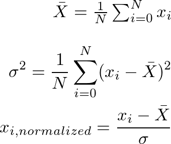

# Modularity - Basics

Modularity allows us to divide an application into smaller, independent parts. This has a lot of advantages such as producing code that is more readable and testable. It also decouples different functionalities which enables division of the workload between developers.

Consider the problem of normalizing a list of doubles (as you might have done in statistics) using the following formula:

### Part 1 : rewriting long code

Functions are the most basic unit of modularity. They allow us to express computations as a black box that takes an input and transforms it into an output. However, if the body of a function becomes too long, it becomes difficult to encapsulate its whole behavior into its name which may lead to misunderstanding and bugs when used by another developer.

Open this folder with your favorite Java IDE and take a look at [src/main/java/App.java](src/main/java/App.java). You will see that the developer who wrote the `compute()` function actually fit the whole program into it and that I/O, computations and error handlers are all over the place. Your task is to refactor `compute()` into smaller functions such that it reads like a recipe, i.e. a list of logical, decoupled smaller steps; you should not change the signatures of the current code.

> :information_source: You can run the code with `gradle run` and test it with `gradle test`

> :information_source: Since we do not instantiate the App class, your functions should be marked `static`

### Part 2 : testing

Testing is a crucial part of the development process. In the following weeks, the course will cover testing extensively and you will be required to test any code that you write.

Open the file [src/test/java/AppTest.java](src/test/java/AppTest.java). You will see that there is one test for now, namely `computeYieldsCorrectResult()` (you should not modify it).

A JUnit test is a function annotated with `@Test` and will contain at least one assertion such as `assertTrue` or `assertEquals`. When you run `gradle test`, all such functions are executed and their assertions verified.

Now that you have refactored your code into smaller functions, write a few test cases per function (think of edge cases).
